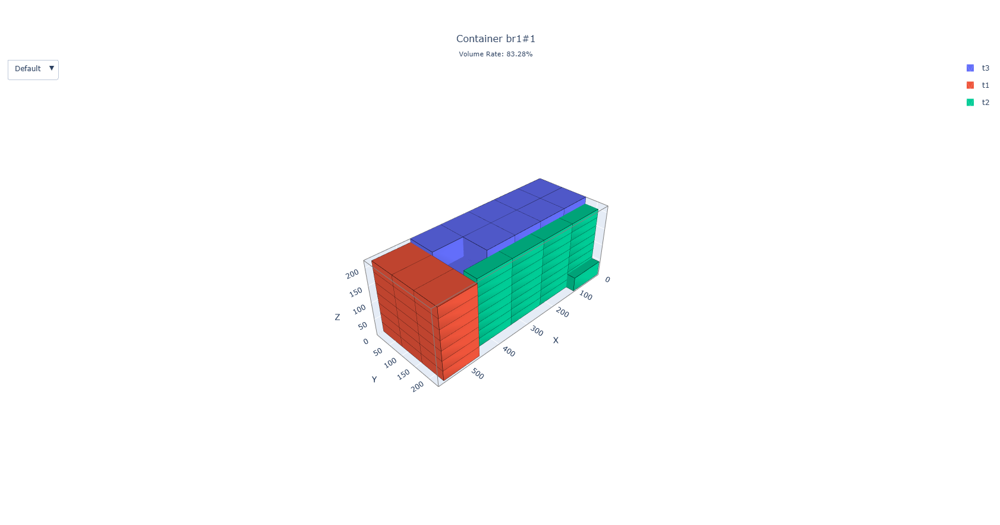

# pack3d

_Pack All~_

## 1. Properties

- Name: pack3d
- Goal: To provide an efficient program to help users optimize the effect of 3D packing.
- Modules: Adopts a modular design, where input/output, algorithms, and constraints can all be replaced.

## 2. Features

- Simple: Stay simple, stay young. While ensuring usability and robustness, it is kept as simple as possible for easy maintenance and reading.
- User-friendly: Carefully designed to be very convenient to use.
- Robust: It won't crash no matter how you use it.
- Lightweight: Very light and simple to use and extend.
- Efficient: Extremely fast, solving all BR test data in under a second.

## 3. Usage

1. Prepare the JSON input file according to the input format described below.
2. Run the program, specifying the input file path via parameters.
3. The program will generate a JSON output file, which can be visualized using `draw.py`.



## 4. Input and Output

### Coordinate System Definition

First, it is agreed that the program uniformly adopts a right-handed coordinate system, defined as follows:

- X-axis: Length, with the positive direction to the right.
- Y-axis: Width, with the positive direction backward.
- Z-axis: Height, with the positive direction upward.

### Input Format

The input file is in JSON format and contains the following fields:

#### ContainerType

| Field Name | Type    | Description                                                               |
| ---------- | ------- | ------------------------------------------------------------------------- |
| `id`       | string  | Unique identifier for the container type                                  |
| `lx`       | integer | Length of the container type                                              |
| `ly`       | integer | Width of the container type                                               |
| `lz`       | integer | Height of the container type                                              |
| `payload`  | number  | Maximum payload of the container type (optional)                          |
| `quantity` | integer | Available quantity of the container type (optional, default is unlimited) |

#### BoxType

| Field Name | Type    | Description                                                |
| ---------- | ------- | ---------------------------------------------------------- |
| `id`       | string  | Unique identifier for the box type                         |
| `lx`       | integer | Length of the box type                                     |
| `ly`       | integer | Width of the box type                                      |
| `lz`       | integer | Height of the box type                                     |
| `orients`  | array   | Allowed placement orientations for the box type (optional) |

##### Orients (Allowed Placement Orientations)

The placement orientation of a box type is represented by a string, with six possible orientations:

- `"XYZ"`: Length (lx) along the X-axis, width (ly) along the Y-axis, height (lz) along the Z-axis (height is vertical)
- `"YXZ"`: Width (ly) along the X-axis, length (lx) along the Y-axis, height (lz) along the Z-axis (height is vertical)
- `"XZY"`: Length (lx) along the X-axis, height (lz) along the Y-axis, width (ly) along the Z-axis (width is vertical)
- `"ZXY"`: Height (lz) along the X-axis, length (lx) along the Y-axis, width (ly) along the Z-axis (width is vertical)
- `"YZX"`: Width (ly) along the X-axis, height (lz) along the Y-axis, length (lx) along the Z-axis (length is vertical)
- `"ZYX"`: Height (lz) along the X-axis, width (ly) along the Y-axis, length (lx) along the Z-axis (length is vertical)

For example, `"orients": ["XYZ", "YXZ"]` means that boxes of this type can only be placed flat, not upright.

If the `orients` field is not specified, the default is `["XYZ", "YXZ"]`, which means only flat placement is allowed.

#### Box

| Field Name | Type   | Description                   |
| ---------- | ------ | ----------------------------- |
| `id`       | string | Unique identifier for the box |
| `type`     | string | Type of the box               |
| `weight`   | number | Weight of the box (optional)  |

#### Input

| Field Name        | Type   | Description                                               |
| ----------------- | ------ | --------------------------------------------------------- |
| `container_types` | array  | List of available container types                         |
| `box_types`       | array  | List of available box types                               |
| `boxes`           | array  | List of boxes to be packed                                |
| `support_rate`    | number | Minimum support rate for boxes (optional, default is 0.7) |

For an example input, please refer to [demo.json](data/demo.json).

### Output Format

The output file is in JSON format and contains the following fields:

#### Container

| Field Name    | Type   | Description                              |
| ------------- | ------ | ---------------------------------------- |
| `type`        | object | The type of the container                |
| `boxes`       | array  | List of packed boxes                     |
| `volume_rate` | number | Volume utilization rate of the container |
| `weight_rate` | number | Weight utilization rate of the container |

##### Box

| Field Name | Type    | Description                        |
| ---------- | ------- | ---------------------------------- |
| `id`       | string  | Unique identifier for the box      |
| `type`     | string  | Unique identifier for the box type |
| `x`        | integer | X-axis coordinate of the placement |
| `y`        | integer | Y-axis coordinate of the placement |
| `z`        | integer | Z-axis coordinate of the placement |
| `orient`   | string  | Placement orientation              |

#### Output

| Field Name       | Type  | Description            |
| ---------------- | ----- | ---------------------- |
| `box_types`      | array | List of box types      |
| `containers`     | array | List of containers     |
| `unpacked_boxes` | array | List of unpacked boxes |

A tree diagram of the complete output format is as follows:

```
output
├── box_types
│   ├── box_type#1
│   ├── box_type#2
│   └── ...
├── containers
│   ├── container#1
│   │   ├── type
│   │   └── boxes
│   │   │   ├── box#1
│   │   │   ├── box#2
│   │   │   └── ...
│   │   ├── volume_rate
│   │   └── weight_rate
│   ├── container#2
│   │   ├── type
│   │   └── boxes
│   │   │   ├── box#3
│   │   │   ├── box#4
│   │   │   └── ...
│   │   ├── volume_rate
│   │   └── weight_rate
│   └── ...
└── unpacked_boxes
    ├── box#5
    ├── box#6
    └── ...
```

## 5. Development

- Language: Rust, requires Rust 1.90+
- Build: Use [Cargo](https://doc.rust-lang.org/cargo/) for building
- Drawing: Use [Python](https://www.python.org) for drawing
- Documentation: Run `cargo doc` to generate documentation
- Style: Run `cargo fmt` to format the code, following the official Rust code style
- Data: Use test data from [OR-Library](https://people.brunel.ac.uk/~mastjjb/jeb/orlib/thpackinfo.html) to evaluate packing performance
